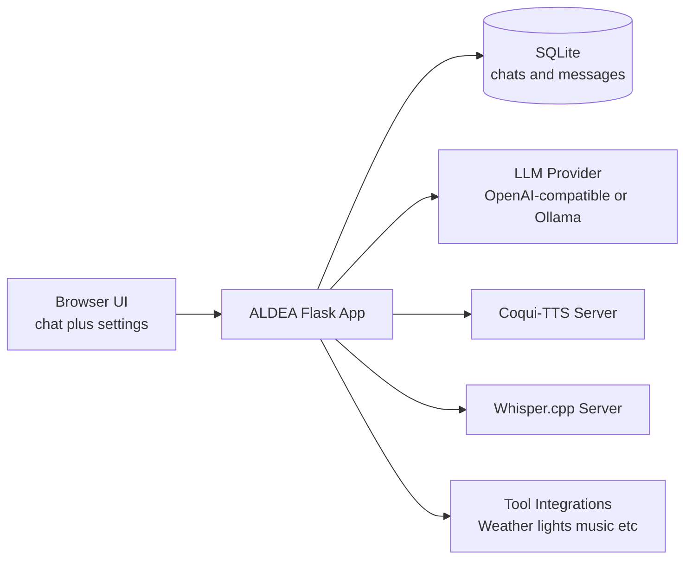

# ALDEA (Flask)

<p align="left">
  
  
  
  
  
</p>

ALDEA is your local-first conversational companion with voice, tools, and a polished multi-theme interface.

## At A Glance

| Capability | What You Get |
| --- | --- |
| Chat Core | OpenAI-compatible and Ollama-native backends |
| Voice Loop | Coqui-TTS output + Whisper.cpp input with wake word support |
| Productivity | Save/restore chats with auto-generated titles |
| Personalization | Theme presets, avatar URLs, and avatar uploads |
| Runtime Control | Full web settings page + SQLite persistence |

## Architecture Snapshot



## Why ALDEA Feels Different

- Designed for long-running local sessions with practical defaults.
- Built for interruption-friendly voice interactions (speak, stop, resume).
- Crafted for experimentation with model/tool settings without code edits.
- Tuned for readability with markdown rendering and syntax-highlighted code blocks.

ALDEA is a polished Python Flask web app that provides a professional chat interface for large language models, with optional voice input/output and configurable visual identity.

The design language includes a default green/black metallic style plus multiple alternate color schemes (pastel, neon, and dark variants). The layout is responsive for desktop and mobile.

## Features

- Slick metallic UI theme (green/black/silver) with animated message reveal
- 10 selectable color schemes (default matrix green + pastel, neon, and dark variants)
- OpenAI-compatible or Ollama-native LLM backends
- Configurable system prompt (with a strong default)
- Configurable context window (default: 16384)
- Configurable assistant and user avatars
- Assistant responses rendered as sanitized Markdown (headings, lists, tables, code blocks)
- Syntax-highlighted Markdown code blocks with clipboard copy icon
- Coqui-TTS integration (optional)
- Whisper.cpp integration for speech input (optional)
- Save chat sessions to SQLite and restore from a chat list
- Save chats with automatic LLM-generated 3-4 word titles (fast low-token mode)
- About screen describing architecture and intent

## Project Structure

- app.py: Flask backend, API routes, integration logic, SQLite persistence
- templates/base.html: shared layout and navigation
- templates/chat.html: main chat interface and save/restore list
- templates/settings.html: full configuration form
- templates/about.html: about page
- static/css/styles.css: full responsive visual design
- static/js/app.js: client-side chat, settings fetch, voice features
- requirements.txt: Python dependencies
- instance/settings.json: runtime settings (created automatically)
- instance/chatbot.db: SQLite chat storage (created automatically)

## Prerequisites

- Python 3.10+ (3.11+ recommended)
- Optional: running LLM endpoint (Ollama or OpenAI-compatible server)
- Optional: running Coqui-TTS server
- Optional: running Whisper.cpp server

## Installation

1. Create and activate a virtual environment:

```powershell
python -m venv .venv
.\.venv\Scripts\Activate.ps1
```

2. Install dependencies:

```powershell
pip install -r requirements.txt
```

3. Run the app with Waitress:

```powershell
python app.py
```

4. Open browser:

- http://localhost:5050

This starts ALDEA with Waitress (a production WSGI server that works on both Windows and Linux).

## Logging with Waitress

ALDEA now emits request and app logs to console when running under Waitress.

- Optional file logging: set `ALDEA_LOG_FILE` to mirror logs to a file.
- Optional log level: set `ALDEA_LOG_LEVEL` (for example `DEBUG`, `INFO`, `WARNING`).
- Legacy compatibility: `HARBOR_LOG_FILE` and `HARBOR_LOG_LEVEL` are still honored.

PowerShell example:

```powershell
$env:ALDEA_LOG_FILE = "instance/aldea.log"
$env:ALDEA_LOG_LEVEL = "INFO"
python app.py
```

## Configuration Guide

Open the Configuration page from the top navigation.

### Visual + Avatars

- Color Scheme: Choose from 10 presets:
  - Matrix Green (default)
  - Blue Onyx
  - Crimson Steel
  - Midnight Violet
  - Cyber Neon
  - Acid Neon
  - Arctic Mint
  - Peach Fuzz
  - Lavender Dream
  - Lemonade Pop
- Assistant Avatar URL: Image URL for assistant messages.
- User Avatar URL: Image URL for user message composer and message bubbles.
- Assistant/User Avatar Upload (optional): Upload a local image file instead of using a URL.
- Remove custom assistant/user avatar: clears uploaded custom avatar and falls back to URL/default.

If both a URL and an uploaded file are provided, the uploaded file is used.

### LLM Provider

- Provider:
  - OpenAI-Compatible: Uses /v1/chat/completions
  - Ollama Native: Uses /api/chat
- Server URL: Base server URL (for example http://localhost:11434)
- API Key: Optional for many local endpoints, required by secured OpenAI-compatible servers
- Model: Model name used by provider
- Context Window: Default 16384; can be increased or lowered as needed
- Temperature: Sampling behavior
- System Prompt: Full assistant behavior definition

### Coqui-TTS

- Enable Text to Speech
- Server URL + Endpoint (default endpoint: /v1/audio/speech)
- Model (optional and typically ignored by Coqui runtime)
- Voice (speaker ID, reference file path, or reference directory path)
- Speed (float, default 1.0)
- Response format (wav, mp3, opus, aac, flac, pcm)
- Default State: Speak Replies Toggle On

The Speak Replies toggle in chat controls whether new assistant replies are spoken automatically.
Long replies are automatically synthesized in smart chunks (sentence-first, then phrase/comma-aware subdivision for long complex sentences) to reduce initial delay and keep narration cadence natural.
The Stop Audio button now interrupts both in-browser TTS playback and active Navidrome playback started by the app.

### Whisper.cpp Speech Input

- Enable Speech Input
- Default State: Transcribe Speech Toggle On
- Wake word activation ("Computer")
- Auto Send on silence detected
- Server URL + Endpoint
- Temperature
- Voice Activity Threshold: sensitivity for speech detection in voice toggle mode
- Silence Timeout (ms): silence duration that ends an utterance and triggers transcription
- Auto Send Silence Delay (ms): delay before auto-submitting a wake-word transcript

Voice Input is a toggle: turn it on and the app continuously listens for speech, uses silence detection to determine end-of-utterance, and transcribes each utterance through Whisper.cpp into the chat input.
When wake word activation is enabled, transcription is gated until the wake word "Computer" is heard.
You can either say "Computer" and then speak your request in the next utterance, or say "Computer" followed immediately by your request.
When both wake word activation and Auto Send on silence are enabled, a recognized utterance is submitted automatically after the configured delay.
While TTS playback is active, voice listening automatically pauses to prevent the assistant audio from being re-captured by microphone input.

### Random Chats

- Enable Random Chats
- Idle Time Before Prompt (seconds)

When enabled, ALDEA monitors user activity in the chat page. After the configured idle duration, it runs a lightweight LLM "ponder" query and posts a short assistant message.

- If there is recent chat history, the message is context-aware and based on recent turns.
- If there is little or no history, the message uses a general thought-provoking prompt.

### Tools

The Configuration page now includes a dedicated **Tools** section for external integrations used by tool calls.

- OpenWeatherMap API Key: used by `get_current_weather`
- Govee API Key: used by `control_govee_device`
- Hue Bridge IP (optional): override auto-discovery used by `control_hue_lights`
- Vector Serial (optional): used by `vector_says`
- Navidrome Server URL / Username / Password / Subsonic Version / MP3 Cache Directory: used by `play_song_from_navidrome`

Tool functions now read these values from app settings (stored in `instance/settings.json`) and fall back to `config.ini` only when a runtime value is not set.

## How Chat Saving Works

- Save Current Chat: stores current messages as a named conversation.
- New: clears working conversation (does not delete saved chats).
- Saved Chats panel: click a chat to restore it.
- Delete button: removes saved chat and messages.

SQLite tables:

- chats(id, title, created_at, updated_at)
- messages(id, chat_id, role, content, created_at)

## API Endpoints

- GET /api/settings: return active runtime settings
- POST /api/chat: send user message + history, get assistant reply
- POST /api/tts: proxy to Coqui OpenAI-compatible /v1/audio/speech endpoint
- POST /api/stt: proxy to Whisper.cpp server
- GET /api/chats: list saved chats
- POST /api/chats: create saved chat
- GET /api/chats/<id>: load chat messages
- PUT /api/chats/<id>: update saved chat
- DELETE /api/chats/<id>: delete saved chat

## Notes on Integrations

Because OpenAI-compatible, Ollama, Coqui-TTS, and Whisper.cpp deployments can differ, endpoint request/response formats may vary by version.

The app includes defensive parsing and defaults, but if your server uses custom fields, adjust the corresponding sections in app.py:

- call_openai_compatible
- call_ollama
- api_tts_proxy
- api_stt_proxy

For Coqui OpenAI-compatible TTS, the proxy sends this upstream JSON payload:

- model
- input
- voice
- speed
- response_format

## Security Notes

- settings.json stores endpoint details and API key in local plain text for convenience.
- Do not use this directly for internet-exposed production without adding:
  - authentication
  - encrypted secret management
  - CSRF protection strategy for your environment
  - stricter request validation

## Mobile Responsiveness

The interface automatically adjusts for narrow displays:

- Sidebar stacks below the main chat panel
- Navigation wraps appropriately
- Message composer simplifies for smaller viewports
- About cards collapse to a single column

## Development Tips

- Use debug mode while iterating locally (already enabled in app.py).
- You can reset all persisted data by deleting:
  - instance/chatbot.db
  - instance/settings.json

They are recreated automatically on next launch.

## Star History

<a href="https://star-history.com/#jeddhor/AldeaChatbot&Date">
  <picture>
    <source media="(prefers-color-scheme: dark)" srcset="https://api.star-history.com/chart?repos=jeddhor/AldeaChatbot&type=Date&theme=dark&legend=top-left" />
    <source media="(prefers-color-scheme: light)" srcset="https://api.star-history.com/chart?repos=jeddhor/AldeaChatbot&type=Date&legend=top-left" />
    
  </picture>
</a>

## License

This project is distributed under the MIT License.

See [LICENSE](LICENSE) for the full license text.
